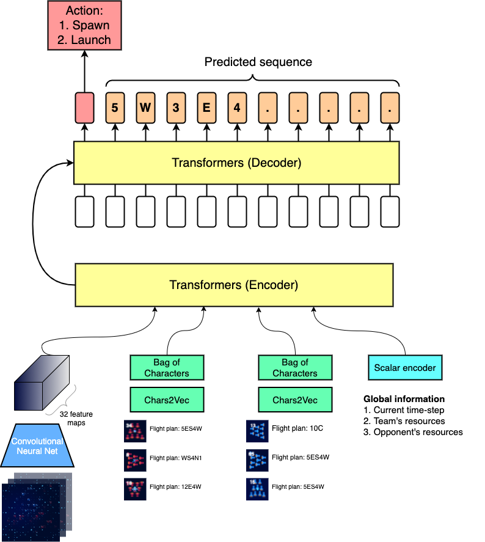
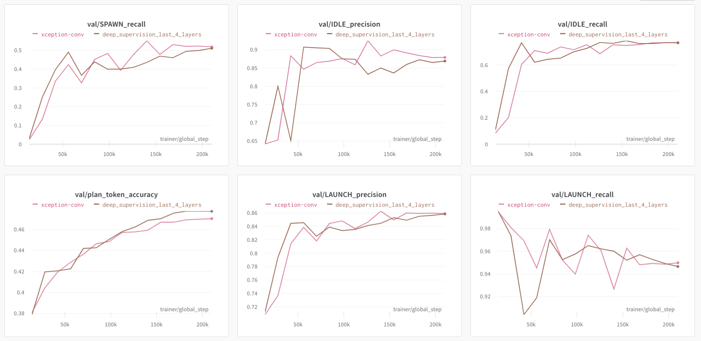
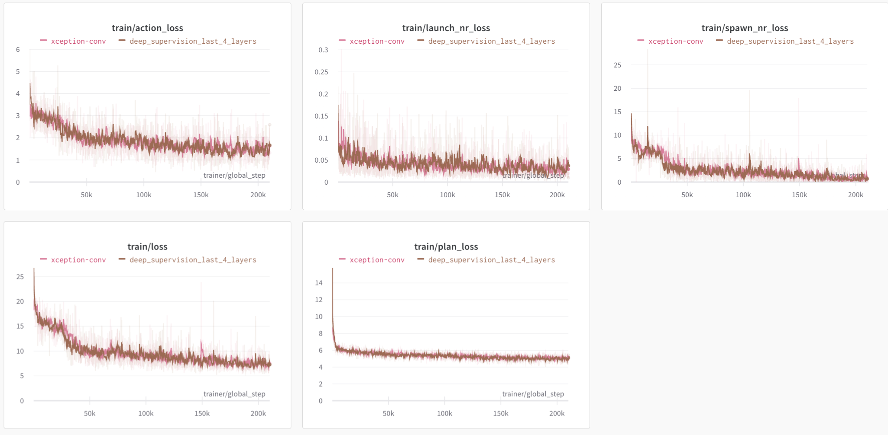

# Kore 2022 - Kaggle Competition

[Competition link](https://www.kaggle.com/c/kore-2022)

"In this turn-based simulation game you control a small armada of spaceships. As you mine the rare mineral “kore” from the depths of space, you teleport it back to your homeworld. But it turns out you aren’t the only civilization with this goal. In each game two players will compete to collect the most kore from the board. Whoever has the largest kore cache by the end of 400 turns—or eliminates all of their opponents from the board before that—will be the winner!"

My approach is to train a supervised learning agent that imitates top teams on the leaderboard. The dataset used for the training contains roughly 200M tuples of a single time-step observation and ships' plans, in which the tuples came from the top five submissions. Here, a ship's plan is represented by a sequence of characters; for instance, the sequence `N 10 W 5` commands the ship to go North for 10 game steps and then go West for 5 game steps.

## Autoregressive Modeling approach to Imitation Learning

### Modeling

I designed a multi-modal Transformers architecture that essentially "translates" the game observation into a plan for a single ship. The Transformers encoder takes in spatial features of the current game state, several scalar features such as the current time-step, team's score, team's resources, vector embeddings of other ships' plans. Here, each modality is passed through a specific type of feature extractors, in particular:

- **Spatial features.** I stacked multiple 2D tensors which capture ships' locations, ships' cargo capacity and etc. into a 3D tensor of 18 channels, then feed it into a 12-layer ResNet with a [GroupNorm](https://arxiv.org/abs/1803.08494) layer in between the residual blocks.
- **Scalar features:** Scalar inputs are concatenated into a single vector and fed into an MLP.
- **Ship plan features.** First, each character is mapped to a learnable vector embedding whose dimension exactly half of the Transformers embedding's dimension (e.g. if the Transformer's embeddings are 512-dim vectors then a character embedding is a 256-dim vector). Then, I concatenated a positional embedding of the same dimensional with the learnable character embedding, sum up these concatenated vectors into a single vector representation. This approach is also known as Bag-of-Words.

The output sequence is decoded by the Transformers decoder in an autoregressive manner, one character at a time just like machine translation! The `[CLS]` token was inputed into an MLP to predict the action type. Overall, my approach closely resembles the [Pixel-Bert](https://arxiv.org/abs/2004.00849) architecture for image-text alignment tasks.

### Training set-up

- Data augmentation: Randomly remove 60% of the game board's pixels.
- Optimizer: AdamW with weight decay of 0.01
- Learning rate: 4e-3
- Learning rate scheduler: CosineAnnealing with 5% warm up steps
- Gradient clipping value: 0.5 (This only matters for the ConvNet module, the rest didn't seem to benefit from gradient clipping)
- Number of training epochs: 20
- Batch size: 64
- GPU: 2 x A100 (80GB VRAM)

I tracked all the training iterations on the W&B platform. Click [here](https://wandb.ai/kaggle-kvu/kore2022?workspace=user-kvu207) to see the results.

