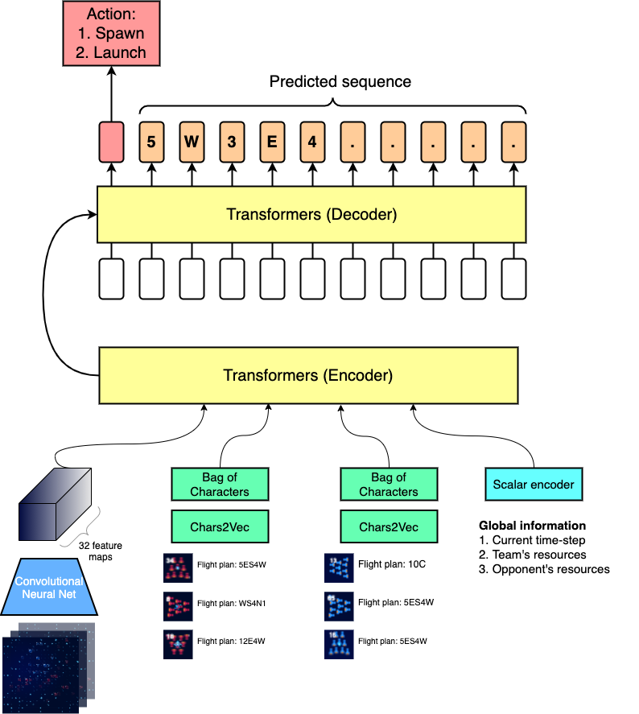

# Logbook

## May 18, 2022
The code is running and the model does not learn at all!  
I know this is the case by observing the losses and accuracies:  
- Train loss does not decrease.  
- Action accuracy is exactly 0.666 which is the majority class :D
- Token accuracy is around 0.066.  

**Hypothesis & possible solutions**
- The input does not contain meaningful information for the task.
  - The information about the current shipyard is burried in the feature map. So perhaps we can center the feature map to the shipyard location
  - See this: https://stats.stackexchange.com/questions/352036/what-should-i-do-when-my-neural-network-doesnt-learn
  - Try to see if the neural net can overfit 5-10 batches. (http://karpathy.github.io/2019/04/25/recipe/)
  - Represent shipyards as tokens.
- The code is not bug-free.
  - Perform deep proofreading.
- Bad hyperparameters:
  - Learning rate was too large/too small
  - Weight decay is too large?

## May 18, 2022 (Evening session)
Removing **BatchNorm2d** in the SpatialEncoder resolved the problem mentioned above. Perhaps batch normalization does not work well in case of sparse/special domain inputs. Normalization will destroy crucial information.

I converted the **spawn_nr_head** into a multiclass classification because there are only ten possible outcomes.

Tracking precision and recall for **action** prediction is useful due to class imbalance; for instance, 66% of the classes is LAUNCH, so the model would just predict this majority class and achieve 66% action accuracy. Furthermore, I removed bias of the **action_head** layer.

## May 28, 2022
